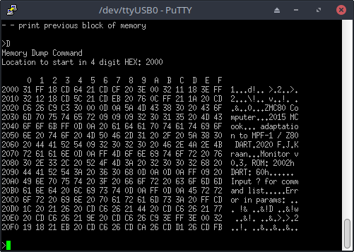

# Simple Z80 serial monitor

This is a learning project for getting a serial monitor working on a modified Multitech MPF-1 Single Board Computer
based on the Z80 microprocessor. 

The  is a single board computer designed 
and build in the early 1980's for computer education. It is a Z80 based board with the traditional 7-segment display, a small keyboard and monitor in EPROM. The idea is to create simple programs in menonics, assemble it by hand and
enter the program code in hexadecimal format. The monitor supports a simple single step mode and code to inspect 
memory and registers.

The goal for this project is, apart from learning Z80 assembly, to extend the development environment with an 
proper graphical editor, cross-assembler and a facility to transfer code from the host to the target machine. My 
solution is to add a serial port in hardware and some Hex-intel receiver code on the target system.

The project has several parts:

 * Modification of the hardware
 * Porting an existing monitor program
 * Setting up an cross-assembly environment and temporary upload facility
 * Adding hex Intel upload and download code to the monitor

## Hardware

The MPF-1 has a bread-board area which is used to add a Z80-DART integrated circuit. The initial version used the
native Z80-CTC as baudrate clock source.

More information on the hardware modification can be found at 
http://electrickery.nl/comp/mpf1/modifications.html#dart.

## Porting of a monitor

The starting point for the monitor is the monitor from: https://github.com/MatthewWCook/Z80Project/tree/master/Z80%20Monitor%20Part%201/Code. Only some addresses had to be changed and the 16550 UART file replaced by Z80 DART code. 

This monitor for a D.I.Y. Z80 system only has three options, ideal for porting and extending afterwards. 

Before adding the hex-intel code, I added some features that supplement the MPF-monitor commands to get some feeling
for programming Z80 code.

## Cross-assembly environment and temporary upload

The development system is Linux based and uses the Z80 assembler from https://github.com/udo-munk/z80pack.
This is different from the assembler used for the original monitor, but the conversion is simple. The 
z80pack/z80asm can generate hex-intel directly, making is easy to upload the code with minimal conversions.

A very useful part of the project, certainly for code fragments larger than a few bytes is a temporary upload
facility. For this an Arduino based ROM-emulator is used, which allows transferring code to a RAM chip which is 
part from the Z80 address space. See https://github.com/electrickery/ROM-emulator. This is a comfortable base to extend the monitor with it's own upload functionality. 

Basically this does what is required, but limited to the memory area controlled by the emulator. As programming 
is in C++, writing hex-intel upload code is quite trival. The goal here is to redo this and more in Z80 assembly.
An new address offset option was added, as the generated hex intel assumed starting address 2000h, the address of 
the emulated ROM, but the emulator exposes only the first 800h bytes from its RAM to the target environment. An
offset command command compensates for this.

A small Python3 script uploads the hex-intel code to the emulated ROM. It reads the file line for line and sends
it over the serial line to the ROM-emulator. As the response is printed too, the process can be monitored.

Usage:

	sh ./asm.sh Z80Monitor.asm
	python3 'romEmuFeed.py' 'Z80Monitor.hex' 2000

The second argument of the script compensates for the target address in the hex intel file with respect to 
the address in the RAM. 

## Native hex-intel upload code 

Writing the other extensions were relative simple and straightforward, but the upload facility with the multiple
interactions with the serial interface were more challenging. The current version processes the short manual 
inserted test record without problem. More testing is needed.

The license is MIT, as the existing monitor code uses this.

## Some screenshots

Startup banner and help:

Changes made to the dump command:

A planned change is to add a download of hex-intel via the monitor too, making a comparison on the host possible.

fjkraan@electrickery.nl, 20210102
